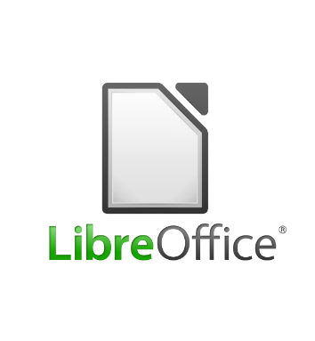

# LibreOffice

LibreOffice is a free and open-source office productivity software suite, a project of The Document Foundation (TDF).
It was forked in 2010 from [OpenOffice.org](openoffice.org), an open-sourced version of the earlier StarOffice.
It consists of programs for **word processing**; creating and editing spreadsheets, **slideshows**, **diagrams**, and **drawings**; working with **databases**; and composing** mathematical formulae**.
It is available in 120 languages.[1]
TDF does not provide support for LibreOffice, but enterprise-focused editions are available from companies in the ecosystem.[2] 

[1]: https://en.wikipedia.org/wiki/LibreOffice#cite_note-languages-9
[2]: https://en.wikipedia.org/wiki/LibreOffice#cite_note-12
